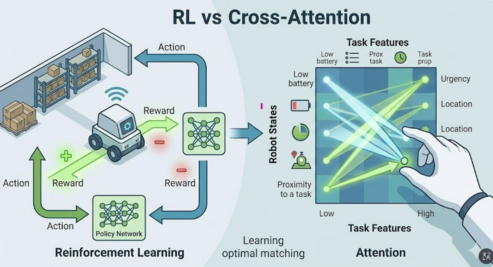

요청하신 대로 **개념 설명(비유)**과 **실제 논문 인용(출처 및 핵심 포인트)**을 단 하나도 생략하지 않고 완벽하게 통합하여 하나의 가이드로 만들어 드립니다. 이 내용을 복사해서 보관하시면 MRTA의 흐름을 한눈에 파악하실 수 있을 거예요.

---

# 🤖 MRTA(다중 로봇 작업 할당) 핵심 기술 통합 가이드

이 가이드는 MRTA의 복잡한 용어들이 실제 연구 현장(KIEE, IEEE 등)에서 어떻게 정의되고 유기적으로 연결되는지 보여줍니다.

---

## 🏗️ 1. 최적화의 기본 도구들: "어떻게 답을 찾을 것인가?"

### **메타휴리스틱 (Metaheuristics)**

* **개념:** 모든 경우의 수를 다 뒤지는 대신, '적당히 괜찮은 답'을 빠르게 찾아가는 전략적 규칙입니다.
* **비유:** 보물찾기를 할 때 섬 전체의 흙을 다 파보는 게 아니라, "나무 밑이나 바위 틈에 있을 확률이 높다"는 전략을 가지고 찾는 것과 같습니다.
* **역할:** 복잡한 문제에서 계산 시간을 획기적으로 줄여줍니다.

### **유전 알고리즘 (GA, Genetic Algorithm)**

* **개념:** 생물의 진화 과정을 본뜬 알고리즘입니다. 여러 해(Solution)를 만들고, 우수한 것끼리 교배시키거나 돌연변이를 일으켜 더 나은 해를 찾아냅니다.
* **비유:** 맛있는 사과를 만들기 위해 당도가 높은 사과나무끼리 접붙이기를 반복하는 과정입니다.
* **[실제 논문 인용 톤]**
> "전통적인 **메타휴리스틱(Metaheuristics)** 기반의 **유전 알고리즘(Genetic Algorithm, GA)**은 탐색 성능은 우수하나, 작업의 수가 증가함에 따라 수렴 속도가 급격히 저하되는 문제가 있다. 특히 초기 해(Initial Solution)를 무작위로 생성할 경우, 최적해에 도달하기까지 과도한 계산 시간이 소요된다."
> *— 출처: 다중 로봇 작업 할당 관련 국내 KIEE 논문 중 발췌 및 재구성*

* **핵심 포인트:** GA가 좋긴 한데, 처음 시작(시드)을 대충 하면 너무 오래 걸린다는 점을 공격하며 연구의 필요성을 강조할 때 주로 인용됩니다.

### **입자 군집 최적화 (PSO, Particle Swarm Optimization)**

* **개념:** 새 떼나 물고기 떼가 먹이를 찾는 방식을 본떴습니다. 각 입자(로봇/해)가 자신의 경험과 무리의 정보를 공유하며 최적의 위치로 이동합니다.
* **비유:** 한 사람이 맛집을 찾으면 주변 사람들에게 알리고, 다 같이 그 근처에서 더 맛있는 집을 찾는 식입니다.

---

## 🗺️ 2. 경로와 공간의 이해: "똑똑하게 시작하고 막힘없이 가기"

### **DBSCAN (Density-Based Spatial Clustering)**

* **개념:** 데이터가 밀집된 정도를 보고 "이건 한 그룹이다"라고 묶어주는 클러스터링(군집화) 기법입니다.
* **비유:** 지도에서 집들이 모여 있는 곳을 보고 "여기는 마을이다"라고 경계를 긋는 것입니다.
* **[실제 기술 방식 인용]**
> "본 논문에서는 **DBSCAN(Density-Based Spatial Clustering of Applications with Noise)** 알고리즘을 활용하여 작업 위치의 밀집도를 분석한다. 클러스터링된 작업군을 기반으로 **GA의 초기 시드(Initial Seed)**를 구성함으로써, 유전 연산 과정에서 불필요한 탐색 범위를 제한하고 전역 최적해(Global Optimum)로의 수렴을 가속화한다."

* **핵심 포인트:** DBSCAN은 단순 보조 도구가 아니라, GA라는 메인 엔진이 빨리 돌아가게 기름을 쳐주는 역할을 한다고 설명합니다.

### **GA 시드 (Initial Seed)**

* **개념:** 알고리즘이 계산을 시작할 때 던져주는 **'최초의 힌트'**입니다.
* **비유:** 소설을 쓸 때 아무것도 없는 백지 상태가 아니라, '주인공 이름'과 '배경' 정도는 미리 정해주고 시작하는 것과 같습니다.

### **데드락 (Deadlock, 교착 상태)**

* **개념:** 두 대 이상의 로봇이 서로의 길을 막고 비켜주기를 기다리며 영원히 멈춰버리는 상태입니다.
* **비유:** 좁은 골목길에서 마주친 두 차가 서로 후진하지 않고 버티는 상황입니다.

---

## 🤖 3. 로봇 지능과 전략: "스스로 배우고 집중하기"

### **강화학습 (Reinforcement Learning)**

* **개념:** 시행착오를 통해 배우는 방식입니다. 로봇이 어떤 행동을 했을 때 결과가 좋으면 '보상'을, 나쁘면 '벌점'을 주어 스스로 최적의 패턴을 익힙니다.
* **비유:** 강아지에게 "손!"을 가르칠 때, 성공하면 간식을 주어 행동을 강화하는 것과 같습니다.
* **[최신 트렌드 인용]**
> "대규모 MRTA 환경에서는 **강화학습(Reinforcement Learning)** 기반의 정책망을 사용한다. 이때 **크로스 어텐션(Cross-Attention)** 메커니즘을 통해 각 로봇의 가용 상태와 작업의 특성 간 정보를 교환하며, 이를 통해 로봇-작업 간의 최적 선호도를 동적으로 계산하여 할당 효율을 극대화한다."

* **핵심 포인트:** 강화학습은 '학습'을 담당하고, 크로스 어텐션은 로봇과 작업을 '매칭'해주는 계산기 역할을 한다고 명시합니다.

### **크로스 어텐션 (Cross-Attention)**

* **개념:** 두 가지 다른 정보(예: 로봇의 상태와 작업의 종류) 사이의 연관성을 계산하여 어디에 집중할지 결정하는 기술입니다.
* **비유:** 쇼핑할 때 '내 예산'과 '상품의 가격'을 대조해 보며 어떤 물건을 살지 결정하는 '비교 분석' 능력입니다.

---

## 📐 4. 할당과 실시간 대응: "수학적 한계 넘어서기"

### **헝가리안 알고리즘 (Hungarian Algorithm)**

* **개념:** '사람-업무'를 1:1로 매칭할 때 전체 비용이 최소가 되게 하는 전통적인 수학 방법입니다.
* **문제점:** 로봇 공학에서는 장애물이나 경로를 무시하고 오직 '직선거리'만 따지는 경우가 많아 실제 현장과는 괴리가 생깁니다.
* **[물리적 제약 관련 인용]**
> "**항가리안 알고리즘(Hungarian Algorithm)**과 같은 단순 거리 기반 할당은 격자 지도 내의 장애물을 고려하지 않아, 좁은 통로에서의 **데드락(Deadlock)** 및 충돌을 유발한다. 이를 방지하기 위해 **Generalized Voronoi Road Map**을 통해 안전 경로를 생성하고, 실시간 **재계획(Replanning)** 알고리즘을 연동하여 주행 안정성을 확보한다."

* **핵심 포인트:** 항가리안의 수학적 깔끔함보다, 실제 현장의 '길막(데드락)' 문제를 해결하기 위해 Voronoi 지도 정보가 필수적임을 강조합니다.

### **Generalized Voronoi Road Map**

* **개념:** 장애물로부터 가장 멀리 떨어진 '안전한 길'들을 연결해 만든 지도입니다.
* **비유:** 복잡한 가구들이 놓인 방 안에서 가구에 부딪히지 않고 다닐 수 있는 '안전 통로 리스트'입니다.

### **재계획 (Replanning)**

* **개념:** 상황이 변했을 때(새 작업 추가, 장애물 발생 등) 기존의 계획을 즉시 수정하는 능력입니다.
* **비유:** 내비게이션이 운전 중에 사고 구간을 발견하고 즉시 경로를 바꾸는 것과 같습니다.

---

## 💡 최종 요약: 기술의 논리적 연결 (Summary)

1. **"너무 복잡해!"** → **메타휴리스틱(GA, PSO)**으로 탐색 시작.
2. **"근데 너무 느려!"** → **DBSCAN**으로 묶고 우수한 **시드**를 주어 가속.
3. **"더 똑똑하게 안 돼?"** → **강화학습**과 **크로스 어텐션**으로 지능형 매칭.
4. **"길 막히면 어떡해?"** → **Voronoi 지도**로 경로를 짜고 문제 발생 시 즉시 **재계획**하여 **데드락** 방지.

---

**이 가이드가 MRTA 기술의 전체적인 그림을 그리는 데 도움이 되었나요? 혹시 특정 부분에 대해 더 깊이 있는 수식이나 구현 코드가 필요하시면 말씀해 주세요!**

🗺️ Generalized Voronoi Road Map (보로노이 지도)란?
1. 개념:
여러 개의 점(또는 장애물)이 있을 때, 가장 가까운 점(또는 장애물)이 어디인지에 따라 공간을 나누는 지도입니다. 로봇 공학에서는 주로 **장애물로부터 가장 멀리 떨어진 '안전한 길'**을 찾아내는 데 사용됩니다. 장애물 사이의 중간 지점들을 연결하면 자연스럽게 충돌 위험이 가장 적은 경로(로드맵)가 만들어집니다.

2. 비유:
복잡한 가구들이 놓인 방 안에서 가구에 부딪히지 않고 다닐 수 있는 **'가장 넓은 복도 리스트'**를 미리 뽑아두는 것과 같습니다. 이 복도(보로노이 선)를 따라 이동하면 로봇은 장애물과 최대한 거리를 두며 안전하게 주행할 수 있습니다.

🖼️ 요청하신 핵심 단어들의 시각적 이미지 생성
이해를 돕기 위해 MRTA 기술의 핵심 단어들이 지닌 직관적인 이미지를 생성해 드립니다. 각 기술이 어떤 느낌으로 작동하는지 시각적으로 파악해 보세요.

🏗️ 1. 최적화 도구: 유전 알고리즘 (GA)
이미지 설명: 수많은 나쁜 사과(안 좋은 해)들 사이에서, 가장 크고 맛있는 사과(최적해)를 찾아내기 위해 사과나무를 교배시키고 좋은 품종만 남기는 진화의 과정.
.png>)

🗺️ 2. 경로의 이해: Generalized Voronoi Road Map
이미지 설명: 복잡한 가구들이 놓여 있는 방 안에서 가구들에 부딪히지 않고 다닐 수 있는 '가장 넓은 복도(보로노이 선)'들을 미리 그려둔 지도. 로봇들이 이 복도를 따라가며 서로 충돌하지 않고 안전하게 이동하는 모습.

🤖 3. 로봇 지능: 강화학습 및 크로스 어텐션
이미지 설명: 로봇이 수많은 실패 끝에 '보상(초록색 빛)'을 받으며 최적의 행동을 배우고(강화학습), 여러 작업과 로봇들 사이에서 '내 상태'와 '할 일'을 잘 비교 분석하며(크로스 어텐션) 서로 다른 정보들을 연결하는 모습.
