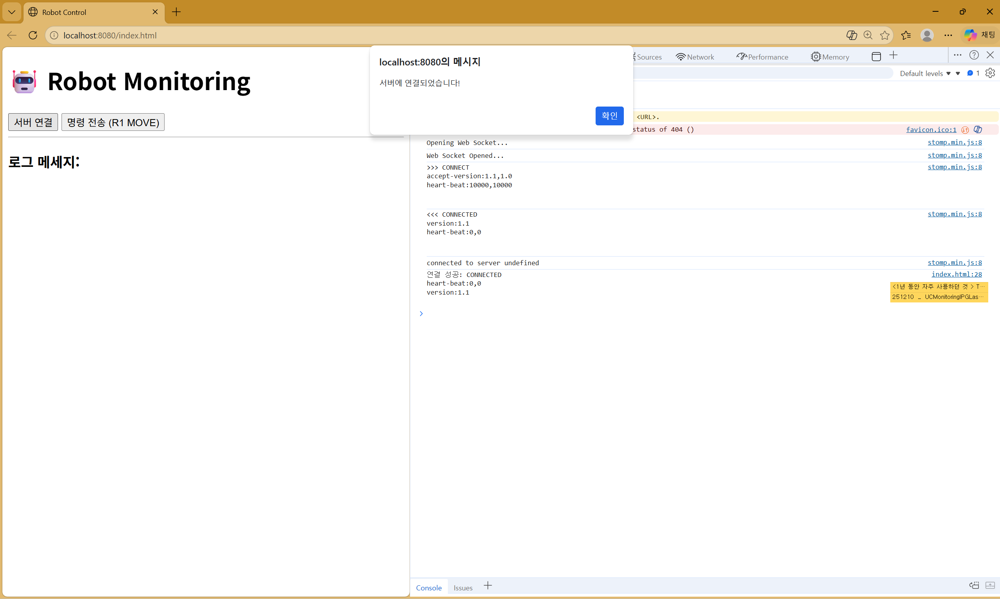
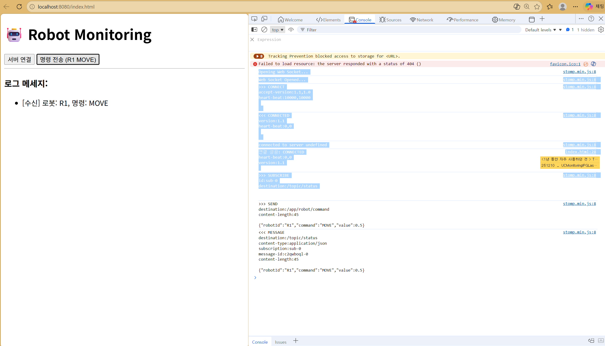

현재 적어주신 것처럼 src 속성이 있는 <script> 태그 안에 코드를 넣으면, 브라우저는 내부 코드를 무시하고 외부 파일만 가져오려고 합니다.

🛠️ 올바른 index.html 작성법
src/main/resources/static/index.html에 아래 구조로 작성해 보세요.

```HTML
<!DOCTYPE html>
<html lang="ko">
<head>
    <meta charset="UTF-8">
    <title>Robot Control</title>
    <script src="https://cdn.jsdelivr.net/npm/sockjs-client@1/dist/sockjs.min.js"></script>
    <script src="https://cdnjs.cloudflare.com/ajax/libs/stomp.js/2.3.3/stomp.min.js"></script>
</head>
<body>
    <h1>🤖 Robot Monitoring</h1>
    <button onclick="connect()">서버 연결</button>
    <button onclick="sendCommand()">명령 전송 (R1 MOVE)</button>
    
    <hr>
    <div id="log-container">
        <h3>로그 메세지:</h3>
        <ul id="messages"></ul>
    </div>

    <script>
        let stompClient = null;

        function connect() {
            const socket = new SockJS('/ws'); // 어제 설정한 엔드포인트
            stompClient = Stomp.over(socket);

            stompClient.connect({}, (frame) => {
                console.log('연결 성공: ' + frame);
                alert("서버에 연결되었습니다!");

                // 구독: 서버가 쏴주는 데이터를 여기서 받음
                stompClient.subscribe('/topic/status', (response) => {
                    const data = JSON.parse(response.body);
                    const msgList = document.getElementById("messages");
                    const li = document.createElement("li");
                    li.textContent = `[수신] 로봇: ${data.robotId}, 명령: ${data.command}`;
                    msgList.appendChild(li);
                });
            });
        }

        function sendCommand() {
            if (!stompClient) {
                alert("먼저 연결 버튼을 눌러주세요!");
                return;
            }
            // 발행: 서버의 @MessageMapping으로 데이터 전송
            stompClient.send("/app/robot/command", {}, 
                JSON.stringify({robotId: "R1", command: "MOVE", value: 0.5}));
        }
    </script>
</body>
</html>
```
📝 필기 포인트: 왜 나눠야 하나요?
동작 원리: <script src="...">는 "이 외부 파일을 가져와서 실행해!"라는 뜻입니다. 태그 사이에 코드가 있어도 브라우저는 읽지 않습니다.

순서 보장: 반드시 라이브러리(SockJS, Stomp)를 먼저 불러온 그 다음 태그에서 new SockJS()를 호출해야 에러가 나지 않습니다. (순서가 바뀌면 "SockJS is not defined" 에러 발생!)

🔍 확인 절차
서버를 재시작합니다.

브라우저에서 http://localhost:8080/index.html 접속 (또는 그냥 localhost:8080).

F12(개발자 도구) 를 켜고 Console 탭을 봅니다.

연결 버튼을 누르고 Connected: ... 문구가 뜨는지 확인합니다.

이제 화면에서 버튼을 눌렀을 때 서버 콘솔에 "수신된 로봇 명령: RobotCommandDTO[...]" 로그가 찍히면 성공입니다!


```console
Opening Web Socket...
stomp.min.js:8 Web Socket Opened...
stomp.min.js:8 >>> CONNECT
accept-version:1.1,1.0
heart-beat:10000,10000


```

```console
>>> SEND
destination:/app/robot/command
content-length:45

{"robotId":"R1","command":"MOVE","value":0.5}

```